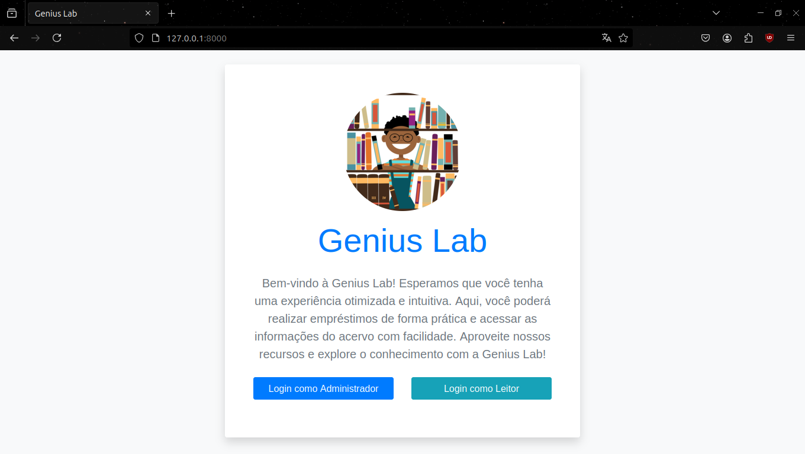

# Projeto Genius Lab


Esse é um sistema de gestão de bibliotecas desenvolvido em Django integrado com banco de dados PostgreSQL. O projeto tem como finalidade a gestão de uma biblioteca chamada 'Genius Lab', de acordo com as regras de negócio a seguir.

## Regras de Negócio

### Administrador
- Deve poder cadastrar novos usuários no sistema;
- Deve poder cadastrar e inativar livros;
- Registrar/aprovar empréstimos e registrar devoluções;
- Além de consultar relatório de empréstimos por período.

### Leitor
- Deve poder visualizar os livros disponíveis para empréstimo;
- Deve poder solicitar empréstimos;
- Deve poder consultar seu histórico de empréstimos.

### Sistema de Empréstimo
- Um livro só pode ser emprestado se estiver disponível;
- Ao registrar um empréstimo, deve-se registrar a data do empréstimo e a data prevista para devolução.


## Requisitos

Antes de começar, verifique se você possui os seguintes pré-requisitos instalados no seu ambiente:

- **Python 3.x**
- **PostgreSQL** (por padrão, o django utiliza o SQLite. Aqui vamos utilizar o PostgreSQL)
- **pip** (gerenciador de pacotes Python)
- **virtualenv**, **pipenv** ou algum gerenciador de dependências da sua preferência (recomendado para isolar as dependências do projeto)

## Como executar esse projeto?

### 1. Clone o repositório

Primeiro, clone o repositório para sua máquina local:

```bash
git clone https://github.com/seu-usuario/seu-repositorio.git
cd seu-repositorio
```

### 2. Crie e ative um ambiente virtual

Deixo como exemplo o venv, mas fique à vontade para escolher o gerenciador de dependências da sua preferência.
#### Para Windows:
```bash
python -m venv venv
venv\Scripts\activate
```
#### Para Linux/macOS:
```bash
python3 -m venv venv
source venv/bin/activate
```
### 3. Instale as dependências

Com o ambiente virtual ativado, instale as dependências do projeto listadas no arquivo requirements.txt:
```bash
pip install -r requirements.txt
```
### 4. Configuração do banco de dados (PostgreSQL)

O projeto está configurado para utilizar o PostgreSQL. Antes de rodar o projeto, você precisa configurar o banco de dados. Crie um banco de dados no PostgreSQL com o nome que você desejar.
Exemplo de comando para criar o banco de dados:
```
psql -U postgres
CREATE DATABASE genius_lab_DB;
```
No arquivo .env (crie na raiz do projeto, se ainda não existir), configure as variáveis de ambiente com a a sua senha de acesso ao PostgreSQL e a **SECRET_KEY** do Django:

```
SECRET_KEY='sua-chave-secreta-aqui'
DB_PASSWORD='sua_senha_do_postgreSQL'
```
#### Observação: as configurações do banco foram colocadas no settings.py do projeto :)
### 5. Crie as tabelas do banco de dados

Com as dependências instaladas e o banco de dados configurado, agora você pode rodar as migrações do Django para criar as tabelas no banco de dados:
```bash
python manage.py migrate
```
##### * se não for usuário windows, onde você ver "python" como comando, utilize "python3".
### 6. Carregue as fixtures iniciais

Para popular o banco de dados com dados iniciais que usei como exemplo e para testes, rode o seguinte comando:
```bash
python manage.py loaddata all_data_fixtures.json
```
Isso irá carregar os dados do arquivo de fixture no banco de dados configurado.

### 7. Crie um superusuário (opcional)

Se desejar acessar o painel administrativo do Django, crie um superusuário utilizando o comando abaixo:
```bash
python manage.py createsuperuser
```
Siga as instruções para definir o nome de usuário, e-mail e senha do superusuário. 
#### Nota: é interessante ter um superusuário para que você consiga ter a visão de administrador do sistema :)
### 8. Inicie o servidor de desenvolvimento

Agora você pode rodar o servidor de desenvolvimento do Django:
```bash
python manage.py runserver
```
Acesse a aplicação em http://127.0.0.1:8000/ no seu navegador. Se você criou um superusuário, também poderá acessar o painel administrativo padrão do Django em http://127.0.0.1:8000/admin/. Também existe uma área administrativa dentro do próprio sistema.

### Ao rodar o projeto, use as seguintes credenciais para entrar como leitor:

`Usuário: leitor`<br>
`Senha: senhaforte`

### Desenvolvido por
<table>
<td align="center">
      <a href="https://github.com/suetonecarneiro" title="gitHub">
        <br>
        <sub>
          <b>Suetone Carneiro</b>
        </sub>
      </a>
    </td>
</table>